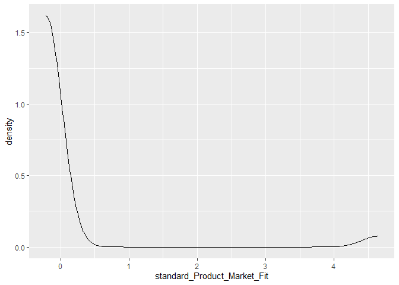
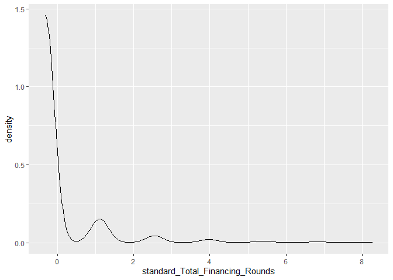
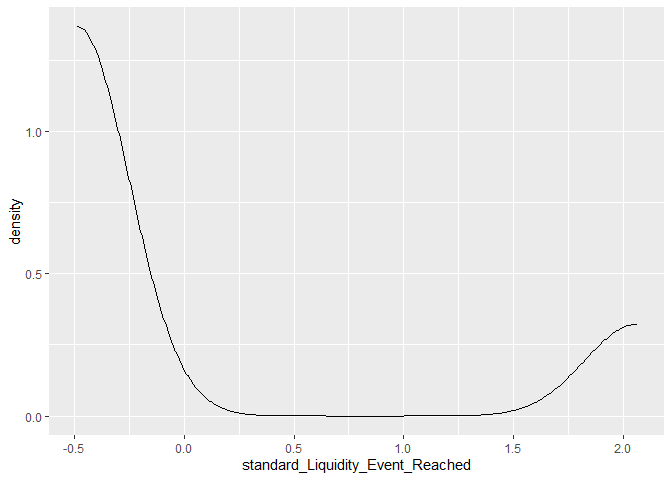
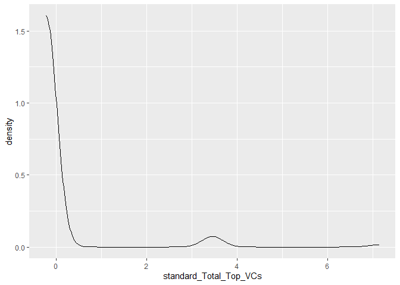
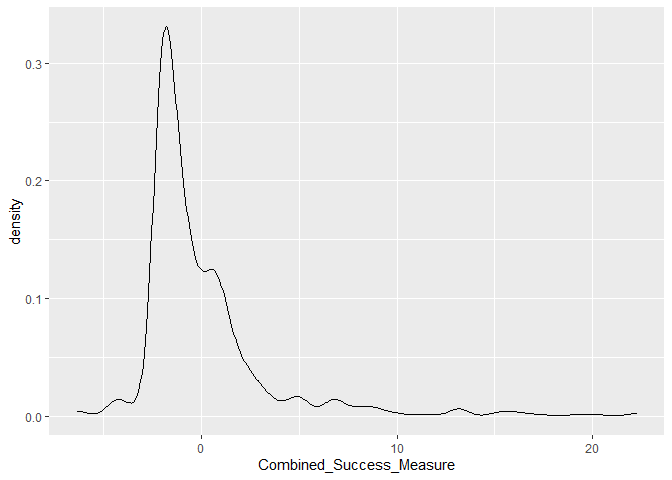

Data Wrangling
================
William DeForest, Nate Coffin, Ethan Dieck, Samantha Manywa
11/1/2021

**Dataset creation using Excel**

``` r
library(readxl)
AirTables_Data <- read_excel("C:\\Users\\wdd72\\OneDrive\\Documents\\Junior Fall\\Fintech Practicum\\Fintech_Data\\Companies-Fintech Practicum View.xlsx")
Unique_Obs <- read_excel("C:\\Users\\wdd72\\OneDrive\\Documents\\Junior Fall\\Fintech Practicum\\Fintech_Data\\Unique_Company_Founder_Obs.xlsx")
PDL_Data <- read_excel("C:\\Users\\wdd72\\OneDrive\\Documents\\Junior Fall\\Fintech Practicum\\Fintech_Data\\Final Clean PDL Data.xlsx")
```

    ## New names:
    ## * industry -> industry...8
    ## * name -> name...20
    ## * size -> size...21
    ## * id -> id...22
    ## * founded -> founded...23
    ## * ...

``` r
DummyVars <- read_excel("C:\\Users\\wdd72\\OneDrive\\Documents\\Junior Fall\\Fintech Practicum\\Fintech_Data\\Dummy Variables 10.7.21.xlsx")
Success_Measures <- read_excel("C:\\Users\\wdd72\\OneDrive\\Documents\\Junior Fall\\Fintech Practicum\\Fintech_Data\\Success Measures.xlsx")
```

``` r
library(dplyr)
```

    ## 
    ## Attaching package: 'dplyr'

    ## The following objects are masked from 'package:stats':
    ## 
    ##     filter, lag

    ## The following objects are masked from 'package:base':
    ## 
    ##     intersect, setdiff, setequal, union

``` r
Unique_Obs$founders_lower <- tolower(Unique_Obs$Founders)
Unique_Obs_PDL <- left_join(Unique_Obs, PDL_Data, by=c("founders_lower"="full_name"))
Unique_Obs_PDL
```

    ## # A tibble: 813 x 586
    ##    Company             Founders        founders_lower  gender birth_year linkedin_userna~
    ##    <chr>               <chr>           <chr>           <chr>  <chr>                 <dbl>
    ##  1 BeSababa            Aaron Wazana    aaron wazana    male   -                         1
    ##  2 54genevels          Abasi Ene-Obong abasi ene-obong male   -                         1
    ##  3 Traffic Marketplace Adam Altman     adam altman     male   1977                      1
    ##  4 SMNI                Adam Altman     adam altman     male   1977                      1
    ##  5 Rebilly             Adam Altman     adam altman     male   1977                      1
    ##  6 Redocly             Adam Altman     adam altman     male   1977                      1
    ##  7 PAX Labs            Adam Bowen      adam bowen      male   -                         1
    ##  8 Juul                Adam Bowen      adam bowen      male   -                         1
    ##  9 Comprisma           Adam Pelavin    adam pelavin    male   -                         1
    ## 10 Cheddr Media        Adam Schoenfeld adam schoenfeld male   -                         1
    ## # ... with 803 more rows, and 580 more variables: facebook_username <dbl>,
    ## #   twitter_username <dbl>, github_username <dbl>, industry...8 <chr>,
    ## #   job_title <chr>, job_title_role <chr>, job_title_sub_role <chr>,
    ## #   job_title_levels <chr>, job_company_name <chr>, job_company_size <chr>,
    ## #   job_company_founded <chr>, job_company_industry <chr>,
    ## #   job_company_location_name <chr>, job_last_updated <dttm>,
    ## #   job_start_date <chr>, name...20 <chr>, size...21 <chr>, id...22 <chr>, ...

``` r
Combined_Data <- left_join(Unique_Obs_PDL, AirTables_Data, by=c("Company"="Name"))
Combined_Data
```

    ## # A tibble: 813 x 703
    ##    Company             Founders.x      founders_lower  gender birth_year linkedin_userna~
    ##    <chr>               <chr>           <chr>           <chr>  <chr>                 <dbl>
    ##  1 BeSababa            Aaron Wazana    aaron wazana    male   -                         1
    ##  2 54genevels          Abasi Ene-Obong abasi ene-obong male   -                         1
    ##  3 Traffic Marketplace Adam Altman     adam altman     male   1977                      1
    ##  4 SMNI                Adam Altman     adam altman     male   1977                      1
    ##  5 Rebilly             Adam Altman     adam altman     male   1977                      1
    ##  6 Redocly             Adam Altman     adam altman     male   1977                      1
    ##  7 PAX Labs            Adam Bowen      adam bowen      male   -                         1
    ##  8 Juul                Adam Bowen      adam bowen      male   -                         1
    ##  9 Comprisma           Adam Pelavin    adam pelavin    male   -                         1
    ## 10 Cheddr Media        Adam Schoenfeld adam schoenfeld male   -                         1
    ## # ... with 803 more rows, and 697 more variables: facebook_username <dbl>,
    ## #   twitter_username <dbl>, github_username <dbl>, industry...8 <chr>,
    ## #   job_title <chr>, job_title_role <chr>, job_title_sub_role <chr>,
    ## #   job_title_levels <chr>, job_company_name <chr>, job_company_size <chr>,
    ## #   job_company_founded <chr>, job_company_industry <chr>,
    ## #   job_company_location_name <chr>, job_last_updated <dttm>,
    ## #   job_start_date <chr>, name...20 <chr>, size...21 <chr>, id...22 <chr>, ...

``` r
library(dplyr)
Combo_Dummys <- left_join(Combined_Data, DummyVars, by=c("founders_lower"="FOUNDER"))
Combo_Dummys
```

    ## # A tibble: 813 x 890
    ##    Company             Founders.x      founders_lower  gender birth_year linkedin_userna~
    ##    <chr>               <chr>           <chr>           <chr>  <chr>                 <dbl>
    ##  1 BeSababa            Aaron Wazana    aaron wazana    male   -                         1
    ##  2 54genevels          Abasi Ene-Obong abasi ene-obong male   -                         1
    ##  3 Traffic Marketplace Adam Altman     adam altman     male   1977                      1
    ##  4 SMNI                Adam Altman     adam altman     male   1977                      1
    ##  5 Rebilly             Adam Altman     adam altman     male   1977                      1
    ##  6 Redocly             Adam Altman     adam altman     male   1977                      1
    ##  7 PAX Labs            Adam Bowen      adam bowen      male   -                         1
    ##  8 Juul                Adam Bowen      adam bowen      male   -                         1
    ##  9 Comprisma           Adam Pelavin    adam pelavin    male   -                         1
    ## 10 Cheddr Media        Adam Schoenfeld adam schoenfeld male   -                         1
    ## # ... with 803 more rows, and 884 more variables: facebook_username <dbl>,
    ## #   twitter_username <dbl>, github_username <dbl>, industry...8 <chr>,
    ## #   job_title <chr>, job_title_role <chr>, job_title_sub_role <chr>,
    ## #   job_title_levels <chr>, job_company_name <chr>, job_company_size <chr>,
    ## #   job_company_founded <chr>, job_company_industry <chr>,
    ## #   job_company_location_name <chr>, job_last_updated <dttm>,
    ## #   job_start_date <chr>, name...20 <chr>, size...21 <chr>, id...22 <chr>, ...

``` r
library(dplyr)
Combined_Data_Success_Dummies <- left_join(Combo_Dummys, Success_Measures, by=c("Company"="Company", "Founders.x"="Founders"))
Combined_Data_Success_Dummies <- Combined_Data_Success_Dummies %>% mutate(standard_Total_Capital_Raised = (Total_Capital_Raised - mean(Total_Capital_Raised))/sd(Total_Capital_Raised), standard_Product_Market_Fit = (Product_Market_Fit - mean(Product_Market_Fit))/sd(Product_Market_Fit), standard_Total_Financing_Rounds = (Total_Financing_Rounds - mean(Total_Financing_Rounds))/sd(Total_Financing_Rounds), standard_Liquidity_Event_Reached = (Liquidity_Event_Reached - mean(Liquidity_Event_Reached))/sd(Liquidity_Event_Reached), standard_length_of_company_life = (length_of_company_life - mean(length_of_company_life, na.rm=TRUE))/sd(length_of_company_life, na.rm=TRUE), standard_Total_Top_VCs = (Total_Top_VCs - mean(Total_Top_VCs))/sd(Total_Top_VCs))

Combined_Data_Success_Dummies <- Combined_Data_Success_Dummies %>% group_by(Company) %>% mutate(Combined_Success_Measure = sum(standard_Total_Capital_Raised, standard_Product_Market_Fit, standard_Total_Financing_Rounds, standard_Liquidity_Event_Reached, standard_length_of_company_life, standard_Total_Top_VCs, na.rm=TRUE))
```

``` r
write.csv(Combined_Data,"C:\\Users\\wdd72\\OneDrive\\Documents\\Junior Fall\\Fintech Practicum\\Fintech_Data\\Master_Combined_Data.csv", row.names = FALSE)
```

``` r
write.csv(Combo_Dummys,"C:\\Users\\wdd72\\OneDrive\\Documents\\Junior Fall\\Fintech Practicum\\Fintech_Data\\Combined_with_Dummies.csv", row.names = FALSE)
```

``` r
write.csv(Unique_Obs_PDL,"C:\\Users\\wdd72\\OneDrive\\Documents\\Junior Fall\\Fintech Practicum\\Fintech_Data\\Unique_Obs_PDL.csv", row.names = FALSE)
```

``` r
write.csv(Combined_Data_Success_Dummies,"C:\\Users\\wdd72\\OneDrive\\Documents\\Junior Fall\\Fintech Practicum\\Fintech_Data\\Combined_Data_For_Regression.csv", row.names = FALSE)
```

``` r
#Standardized Success variable distributions
library(dplyr)
library(ggplot2)
CMC_Obs <- Combined_Data_Success_Dummies %>% filter(CMC_Dummy == "1")
CMC_Obs
```

    ## # A tibble: 147 x 904
    ## # Groups:   Company [137]
    ##    Company             Founders.x founders_lower gender birth_year linkedin_userna~
    ##    <chr>               <chr>      <chr>          <chr>  <chr>                 <dbl>
    ##  1 Traffic Marketplace Adam Altm~ adam altman    male   1977                      1
    ##  2 SMNI                Adam Altm~ adam altman    male   1977                      1
    ##  3 Rebilly             Adam Altm~ adam altman    male   1977                      1
    ##  4 Redocly             Adam Altm~ adam altman    male   1977                      1
    ##  5 Cheddr Media        Adam Scho~ adam schoenfe~ male   -                         1
    ##  6 Simply Measured     Adam Scho~ adam schoenfe~ male   -                         1
    ##  7 Siftrock            Adam Scho~ adam schoenfe~ male   -                         1
    ##  8 SelfMade            Ajay Srid~ ajay sridhar   male   1989                      1
    ##  9 AgVend              Alexander~ alexander rei~ male   1989                      1
    ## 10 RetailNext          Alexei Ag~ alexei agratc~ -      -                         1
    ## # ... with 137 more rows, and 898 more variables: facebook_username <dbl>,
    ## #   twitter_username <dbl>, github_username <dbl>, industry...8 <chr>,
    ## #   job_title <chr>, job_title_role <chr>, job_title_sub_role <chr>,
    ## #   job_title_levels <chr>, job_company_name <chr>, job_company_size <chr>,
    ## #   job_company_founded <chr>, job_company_industry <chr>,
    ## #   job_company_location_name <chr>, job_last_updated <dttm>,
    ## #   job_start_date <chr>, name...20 <chr>, size...21 <chr>, id...22 <chr>, ...

``` r
dist_total_capital_raised <- ggplot(data=Combined_Data_Success_Dummies, aes(x=standard_Total_Capital_Raised)) + geom_density()
dist_total_capital_raised
```

<!-- -->

``` r
dist_Product_Market_Fit <- ggplot(data=Combined_Data_Success_Dummies, aes(x=standard_Product_Market_Fit)) + geom_density()
dist_Product_Market_Fit
```

<!-- -->

``` r
dist_Total_Financing_Rounds <- ggplot(data=Combined_Data_Success_Dummies, aes(x=standard_Total_Financing_Rounds)) + geom_density()
dist_Total_Financing_Rounds
```

<!-- -->

``` r
dist_Liquidity_Event_Reached <- ggplot(data=Combined_Data_Success_Dummies, aes(x=standard_Liquidity_Event_Reached)) + geom_density()
dist_Liquidity_Event_Reached
```

<!-- -->

``` r
dist_length_of_company_life <- ggplot(data=Combined_Data_Success_Dummies, aes(x=standard_length_of_company_life)) + geom_density()
dist_length_of_company_life
```

    ## Warning: Removed 29 rows containing non-finite values (stat_density).

<!-- -->

``` r
dist_Total_Top_VCs <- ggplot(data=Combined_Data_Success_Dummies, aes(x=standard_Total_Top_VCs)) + geom_density()
dist_Total_Top_VCs
```

<!-- -->

``` r
dist_Combined_Success_Measure <- ggplot(data=Combined_Data_Success_Dummies, aes(x=Combined_Success_Measure)) + geom_density()
dist_Combined_Success_Measure
```

<!-- -->
